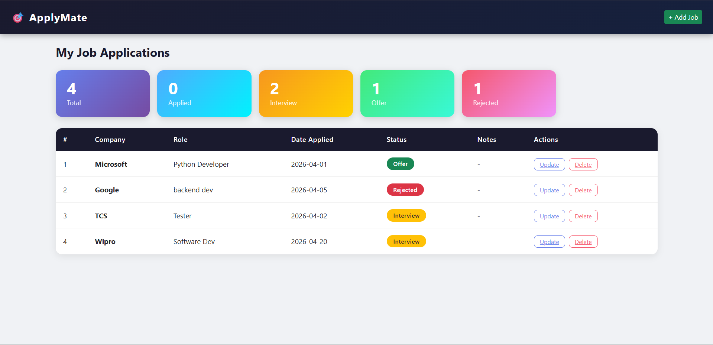

# 🎯 ApplyMate

A web-based Job Application Tracker built with Flask, SQLAlchemy, and Bootstrap 5.
Track every job you apply to — manage status, view summaries, and stay organized during your job hunt.

---

## 🚀 Features

- Add job applications with company, role, date, status and notes
- View all applications in a clean, styled table
- Summary cards showing Total, Applied, Interview, Offer and Rejected counts
- Update application status anytime
- Delete applications
- Color-coded status badges

---

## 🛠️ Tech Stack

| Technology | Purpose |
|---|---|
| Python + Flask | Backend web framework |
| SQLAlchemy | ORM for database management |
| SQLite | Lightweight local database |
| Jinja2 | HTML templating engine |
| Bootstrap 5 | Frontend styling |
| CSS3 | Custom styles and animations |

---

## 📁 Project Structure

```
ApplyMate/
│
├── app.py              # Flask app and routes
├── models.py           # SQLAlchemy database model
├── templates/
│   ├── base.html       # Base layout with navbar
│   ├── index.html      # Home page with job table
│   ├── add_job.html    # Add new application form
│   └── update_job.html # Update application status
└── static/
    └── style.css       # Custom styles
```

---

## ⚙️ Setup and Run

```bash
# Clone the repository
git clone https://github.com/itzPR4TIK/ApplyMate.git
cd ApplyMate

# Create virtual environment
python -m venv venv
venv\Scripts\activate

# Install dependencies
pip install flask flask-sqlalchemy

# Run the app
python app.py
```

Visit `http://127.0.0.1:5000` in your browser.

---

## 📸 Screenshots



---

## 👨‍💻 Author

**Pratik Nagpure**  
[GitHub](https://github.com/itzPR4TIK) 
